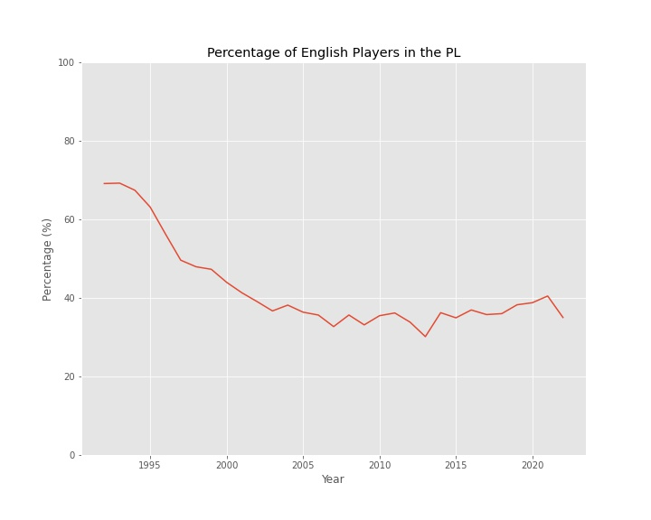
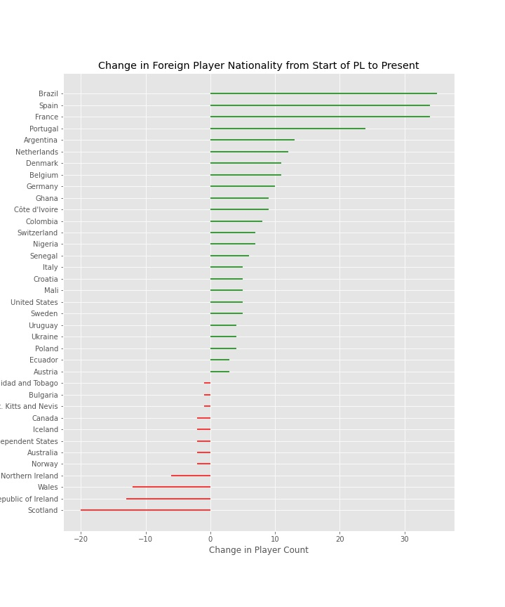

# premier-league-map
mapping the nationalities of PL players

## Plan
The plan is to create interactive and/or snapshot maps of the nationalities of players in England's Premier League. Given taht the Premier League is recognized as one of the top leagues in the world for football players, it draws players from all over the globe. It would be interesting to visualize where these players come from and identify if any trends change over time. I also want to play with the geospatial population density maps - this could be done by seeing what towns players come from in a country. 

## Data
Going to start with getting data from FBRef, since it can be easily downloaded as CSV files instead of web scraping. 

## Visualization
Several options ranging in ease-of-use and customization. Options include geopandas, pydeck, kepler.gl, pygal. Going to try starting with pygal for simplicity.

### Day 1

FBRef was the first website I found which had the player nationality data. It had the nation, number of players, cumulative number of minutes by those players, and player names (which was capped at around 10 for countries with 10+ players). There were options to download Excel files, convert directly to CSV formatted text on the webpage, or get a link to the webpage table. Here is one of their nationality pages for reference/citing: https://fbref.com/en/comps/9/1997-1998/nations/1997-1998-Premier-League-Nationalities. 

To start, I downloaded an Excel file and loaded it into a pandas Dataframe. It worked, but the formatting of symbols of the names was odd. I copy and pasted the CSV data into a text editor and opened that as a Dataframe, which worked well. So I'll quickly copy and paste ~10 years of data into CSV files and load them. I could make a script to scrape the webpages, helped with the link to the table, but one thing I have learned is that automating that process will take me far longer than copy pasting for 2 minutes, and I only need a little bit of data to start. 

The CSV files don't need much cleaning, primarily reformatting and replacing NaNs with 0s where appropriate. The data only looks to go back to 1992, which is when the Premier League started. Since it is not very historical and I have already manually collected over a dozen years, I'll copy the other files and skip the web scraping. Then I'll automate the cleaning of all the other files. 

It might be easier to save all the data in one CSV file with the associated season. They would need to be split out to compare different countries, but if looking at just one country over time it could be useful to have it in one file, so I'll add that as well.  

Here is the first 30 entries of the master DataFrame: 

|   Year |   Rank | Nation                             | Abbreviation   |   Count |   Minutes | List                                                                                                                                              |
|-------:|-------:|:-----------------------------------|:---------------|--------:|----------:|:--------------------------------------------------------------------------------------------------------------------------------------------------|
|   1992 |      1 | England                            | eng            |     363 |    619773 | Brian Deane Matt Le Tissier Teddy Sheringham Les Ferdinand David White Mike Newell Paul Wilkinson Jason Dozzell Peter Beardsley John Williams ... |
|   1992 |      2 | Scotland                           | sct            |      39 |     65060 | Brian McClair Tommy Wright John Hendrie Kevin Gallacher John Wark Colin Hendry Bryan Gunn Gary McAllister Scot Gemmill Paul Bernard ...           |
|   1992 |      3 | Republic of Ireland                | ie             |      32 |     64306 | Niall Quinn Steve Staunton Eddie McGoldrick Andy Townsend Paul McGrath Denis Irwin Roy Keane Ray Houghton Mike Milligan Terry Phelan ...          |
|   1992 |      4 | Wales                              | wls            |      29 |     61435 | Mark Hughes David Phillips Dean Saunders Ryan Giggs Gary Speed Ian Rush Mark Bowen Eric Young Geraint Williams Neville Southall ...               |
|   1992 |      5 | Northern Ireland                   | nir            |      11 |     20822 | Iain Dowie Alan McDonald Nigel Worthington Mal Donaghy Lawrie Sanchez Kingsley Black Danny Wilson Steve Morrow Paul Williams Keith Rowland ...    |
|   1992 |      6 | Norway                             | no             |       8 |      9568 | Gunnar Halle Erik Thorstvedt Erland Johnsen Stig Inge Bjørnebye Frank Strandli Pål Lydersen Henning Berg Kåre Ingebrigtsen                        |
|   1992 |      7 | Jamaica                            | jm             |       4 |      9586 | Robbie Earle Frank Sinclair Fitzroy Simpson Danny Maddix                                                                                          |
|   1992 |      8 | Netherlands                        | nl             |       4 |      9045 | Hans Segers Ken Monkou Michel Vonk Orpheo Keizerweerd                                                                                             |
|   1992 |      9 | Denmark                            | dk             |       4 |      8700 | Peter Schmeichel John Jensen Jan Mølby Torben Piechnik                                                                                            |
|   1992 |     10 | Australia                          | au             |       4 |      2144 | Mark Bosnich Jason Kearton Vlado Bozinovski Andy Petterson                                                                                        |
|   1992 |     11 | United States                      | us             |       3 |      4615 | John Harkes Roy Wegerle Preki                                                                                                                     |
|   1992 |     12 | Sweden                             | se             |       3 |      4180 | Roland Nilsson Anders Limpar Patrik Andersson                                                                                                     |
|   1992 |     13 | Zimbabwe                           | zw             |       2 |      2740 | Peter Ndlovu Bruce Grobbelaar                                                                                                                     |
|   1992 |     14 | Commonwealth of Independent States | xc             |       2 |      1715 | Andrei Kanchelskis Dmitri Kharine                                                                                                                 |
|   1992 |     15 | Iceland                            | is             |       2 |      1462 | Þorvaldur Örlygsson Guðni Bergsson                                                                                                                |
|   1992 |     16 | Canada                             | ca             |       2 |      1437 | Craig Forrest Frank Yallop                                                                                                                        |
|   1992 |     17 | Germany                            | de             |       2 |       296 | Matthias Breitkreutz Stefan Beinlich                                                                                                              |
|   1992 |     18 | France                             | fr             |       1 |      3014 | Eric Cantona                                                                                                                                      |
|   1992 |     19 | Montserrat                         | ms             |       1 |      2884 | Ruel Fox                                                                                                                                          |
|   1992 |     20 | Trinidad and Tobago                | tt             |       1 |      1918 | Dwight Yorke                                                                                                                                      |
|   1992 |     21 | Bulgaria                           | bg             |       1 |      1542 | Boncho Genchev                                                                                                                                    |
|   1992 |     22 | Spain                              | es             |       1 |      1475 | Nayim                                                                                                                                             |
|   1992 |     23 | Poland                             | pl             |       1 |      1464 | Robert Warzycha                                                                                                                                   |
|   1992 |     24 | Israel                             | il             |       1 |      1400 | Ronny Rosenthal                                                                                                                                   |
|   1992 |     25 | Czech Republic                     | cz             |       1 |      1288 | Jan Stejskal                                                                                                                                      |
|   1992 |     26 | St. Kitts and Nevis                | kn             |       1 |       412 | Bobby Bowry                                                                                                                                       |
|   1992 |     27 | Nigeria                            | ng             |       1 |       111 | Efan Ekoku                                                                                                                                        |
|   1992 |     28 | Hungary                            | hu             |       1 |         9 | István Kozma                                                                                                                                      |
|   1993 |      1 | England                            | eng            |     367 |    630123 | Andy Cole Chris Sutton Matt Le Tissier Alan Shearer Ian Wright Dean Holdsworth Peter Beardsley Brian Deane Mark Bright Les Ferdinand ...          |
|   1993 |      2 | Scotland                           | sct            |      38 |     51053 | Gary McAllister Graeme Sharp Bryan Gunn John Wark Gordon Strachan Steve Clarke David Rennie Paul Bernard Kevin Gallacher Steve Nicol ...          |

The data looks good so far. One thing I did notice however was a name I thought to be English in the list of French players for 2022 - Michael Olise. Searching online tells me that despite being born in England and playing in English youth academies, he plays for the French national team due to his mother's heritage. A quick check on the data source, FBRef, confirms that players are listed based on their international team standing if applicable, among other notes on nationality which are: 

1. Identify all pieces of evidence that may confer national affiliation to a player. This naturally includes appearances for senior or youth national teams, but also includes secondary pieces of evidence such as country of birth, family relationships, and stated preferences.

2. If a player has represented the senior team for a FIFA member association in an official competition, this will usually be their permanent and immutable primary nationality. If a player has represented a youth team (or the senior team in an unofficial competition) for a FIFA member association, this will be their permanent primary nationality unless and until they are granted approval by FIFA to change nationality. If a player has never represented a FIFA member association on any level, we are typically making an unscientific guess as to the player's nationality based on the other factors (country of birth, family, stated preferences).

3. Any other national affiliations we might identify that are different from the player's primary nationality is displayed as a secondary nationality. For players who have not represented the senior team for a FIFA member association in an official competition (or been approved for a one-time nationality change), any secondary nationalities a player might have may plausibly become the player's primary nationality in the future. Otherwise, secondary nationalities have no special meaning.

This does not affect the data, but does mean we have to keep this context in mind. Many players born in one country choose to play for another international country due to heritage, naturalization, or better playing opportunities. For example, many English born players choose to play for other countries, such as Michail Antonio playing for Jamaica. On the other hand, Raheem Sterling was born in Jamaica but plays for England. So while we can't say this skews the data one way or another at the moment, we can keep it in mind.  

I'll pick something quick to look at to see if we can extract meaningful analyses from these data. One question to start with is about the role of English players in the Premier League. We can calculate the total number of players in the league each season, and then find the percentage of those who are English and track it over time. 

### Day 2

It would be useful to summarize the data per country, since we have an entry per country per year at the moment. We can calculate some overall statistics about countries, with a snippet shown here: 

| Nation                             |   First Year |   Avg Rank |   Max Rank |   Min Rank |   Avg Count |   Max Count |   Min Count |   Avg Minutes |   Total Minutes |
|:-----------------------------------|-------------:|-----------:|-----------:|-----------:|------------:|------------:|------------:|--------------:|----------------:|
| England                            |         1992 |        1   |          1 |          1 |       233.7 |         367 |         164 |        315787 |         9789420 |
| Scotland                           |         1992 |        5   |          2 |         13 |        23.5 |          39 |           8 |         31778 |          985120 |
| Republic of Ireland                |         1992 |        3.3 |          2 |          7 |        28.8 |          37 |          19 |         40312 |         1249677 |
| Wales                              |         1992 |        6.5 |          2 |         12 |        17.9 |          30 |          11 |         25942 |          804227 |
| Northern Ireland                   |         1992 |       13.5 |          5 |         31 |         8.9 |          16 |           3 |         13794 |          427618 |
| Norway                             |         1992 |       17.5 |          4 |         47 |         8.3 |          22 |           2 |         12321 |          381981 |
| Jamaica                            |         1992 |       18.2 |          7 |         33 |         6   |          12 |           3 |          8533 |          264536 |
| Netherlands                        |         1992 |        6.8 |          3 |         10 |        14.8 |          26 |           4 |         21476 |          665777 |
| Denmark                            |         1992 |       14.6 |          8 |         37 |         7.7 |          15 |           2 |         11521 |          357155 |
| Australia                          |         1992 |       18.3 |          8 |         49 |         6.3 |          13 |           2 |          8593 |          257816 |
| United States                      |         1992 |       19.3 |          6 |         52 |         5.6 |          13 |           1 |          8206 |          254399 |
| Sweden                             |         1992 |       18.1 |          7 |         37 |         6.1 |          13 |           2 |          7872 |          244050 |
| Zimbabwe                           |         1992 |       46.3 |         13 |         70 |         1.4 |           2 |           1 |          1764 |           31766 |
| Commonwealth of Independent States |         1992 |       33.3 |         14 |         64 |         1.6 |           2 |           1 |          2400 |           21602 |
| Iceland                            |         1992 |       33.7 |         15 |         61 |         2.7 |           5 |           1 |          4462 |          120476 |
| Canada                             |         1992 |       44.7 |         16 |         71 |         1.5 |           3 |           1 |          1997 |           51937 |
| Germany                            |         1992 |       16.7 |          7 |         43 |         7.3 |          16 |           2 |         10327 |          309816 |
| France                             |         1992 |        5.3 |          2 |         25 |        25.5 |          44 |           1 |         37873 |         1174070 |

Using this new table, we can easily check countries' statistics like their highest ever rank by player count. We can also plot some more data, like the change in foreign player counts from the start of the Premier League to toda (with a minimum increase of 2). 

Make a treemap (continent wise)

So I explored a couple things like trends of nationalities over time, but I want to get into the map. I'll try one more thing though, to make a graph of all nationalities over time. 

